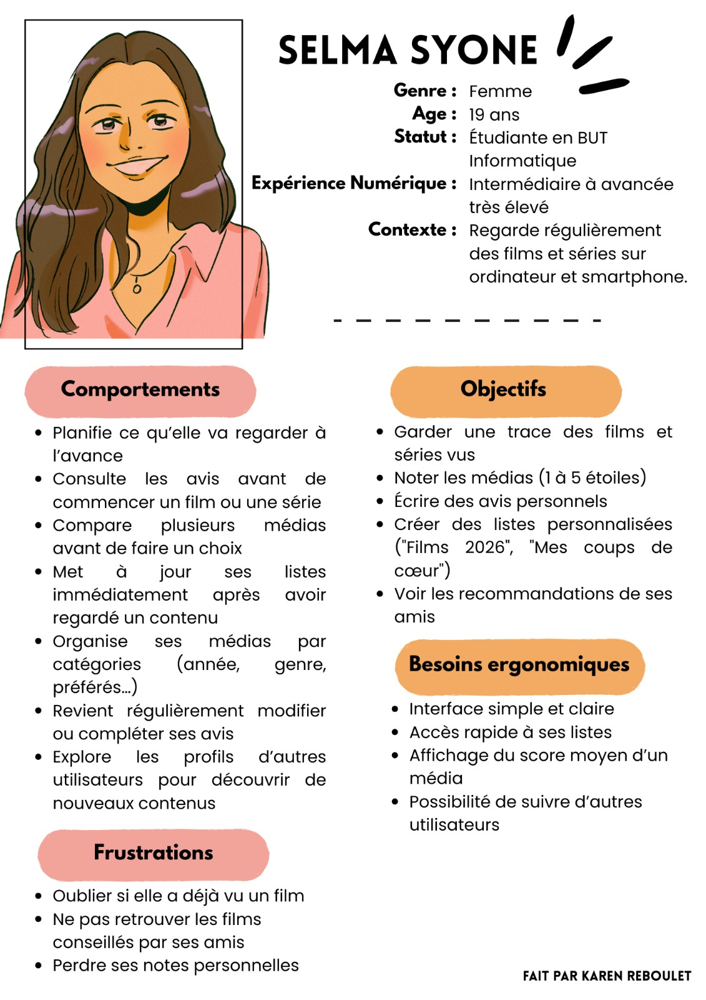
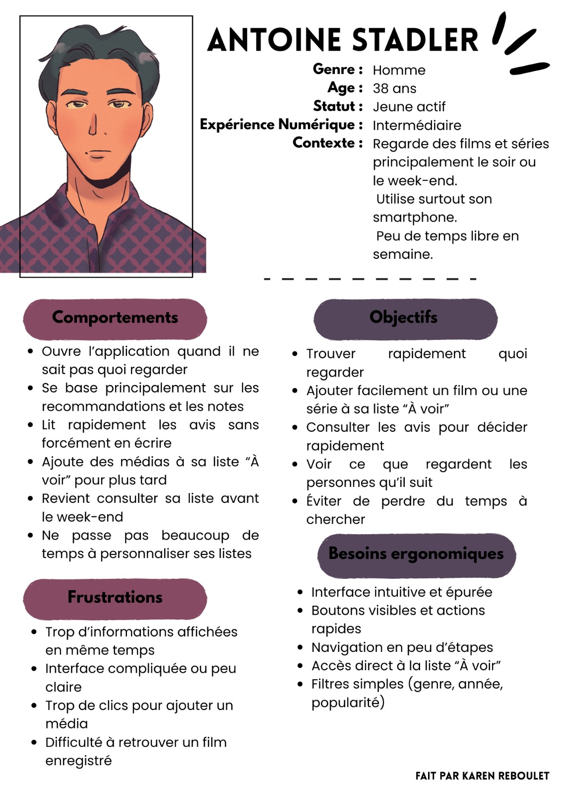

# Rendu 1 : Analyse et Design IHM

Ce premier rendu se concentre sur l'analyse des besoins utilisateurs et la conception de l'interface graphique (IHM) de l'application **Trackr**.

!!! info "Documents sources"
    Les fichiers originaux sont dans ce dossier.
    
    *   [:material-file-pdf: Rapport IHM (PDF)](Rendu-n1%20IHM%20SAE-1256%20EF-3.pdf)
    *   [:material-file-word: Tables fonctionnelles et Scénarios](Tables_fonctionnelles%20et%20Scénarios.docx)

## Analyse des Utilisateurs (Personas)
Nous avons défini des profils types d'utilisateurs pour guider le développement de l'interface :

  
  

---
[👉 Passer au Rendu 2](../Rendu%202/rendu2.md){ .md-button .md-button--primary }
